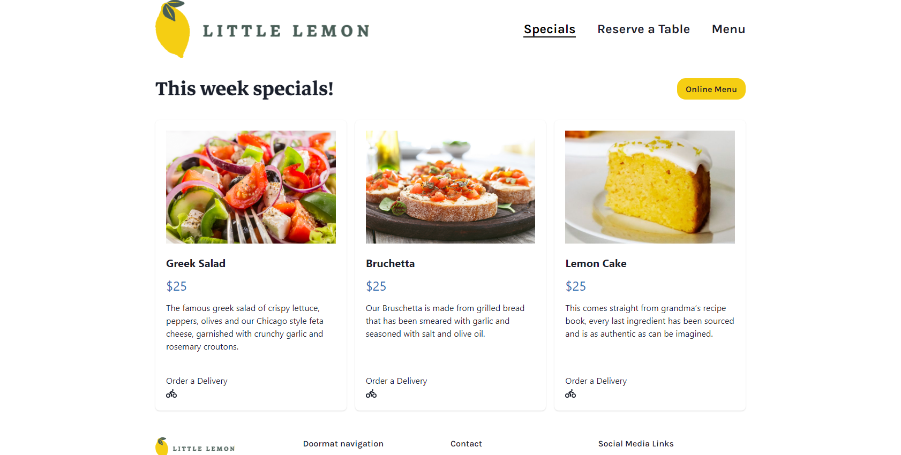

# Little Lemon Restaurant Web App

## Project Overview

Welcome to the Little Lemon restaurant web app project! This project was created as a part of the final assessment for the front-end development course. It demonstrates a comprehensive understanding of front-end development concepts using React. The application is designed to handle table bookings, display weekly specials, and navigate through different sections of the restaurant's offerings.

## Features

- **Responsive Navbar**: Adapts between a hamburger menu for small screens and a full navigation bar for larger screens.
- **Hero Section**: Dynamic hero section with a background image for small screens and a side image for larger screens.
- **Special Dishes**: Display of special dishes in a card format that adjusts to screen size.
- **Booking Form**: A form to handle table bookings.
- **Routing**: Implemented using React Router to navigate between different pages.

## Technologies Used

- **React**
- **React Router**
- **Chakra UI**
- **FontAwesome**
- **CSS** (with responsive design)

## Screenshots

### Home Page

### Specials Page

### Booking Page

